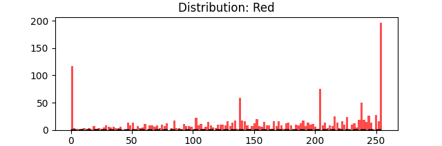
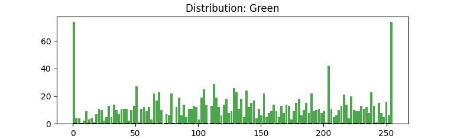
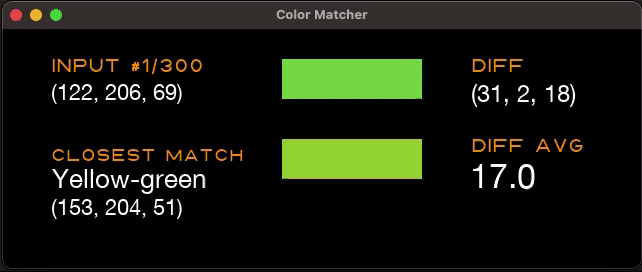

# Color Matcher
Matches input RGB values to closest color in the stored database. 
 
Developed for use in my [tricorder project](https://github.com/shivamkundan/Tricorder-RaspberryPi) with its photo-spectrometer ([AS7411](https://www.adafruit.com/product/4698)) providing the input.

## API Reference
https://color-matcher.readthedocs.io/en/latest/index.html 
## Database
Color names and values acquired from the following sources:
* https://web.njit.edu/~walsh/rgb.html (Copyright © 2010 Kevin J. Walsh)
* [[Wikipedia] List of colors: A-F](https://en.wikipedia.org/wiki/List_of_colors:_A%25E2%2580%2593F)
* [[Wikipedia] List of colors: G-M](https://en.wikipedia.org/wiki/List_of_colors:_G%25E2%2580%2593M)
* [[Wikipedia] List of colors: N-Z](https://en.wikipedia.org/wiki/List_of_colors:_N%25E2%2580%2593Z)

### Distribution of Available Colors

## Screen Recording
A simulation using random RGB inputs. Colors with average RGB distance of < 10 seem to match pretty closely. However, some colors still look quite different even with < 10 difference. Probably a subjective thing depending upon the monitor and the viewers vision.

