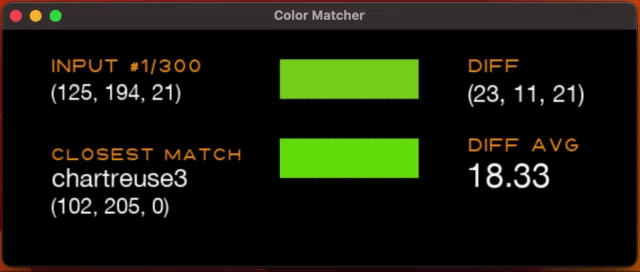

# Color Matcher
 Matches input RGB values to closest color in database. Part of my tricorder project.

## Screen Recording
A sample using random RGB inputs. Colors with average RGB distance of < 10 seem to match pretty closely. However, some colors still look quite different even with < 10 difference. Probably a subjective thing depending upon the monitor and the viewers vision.

